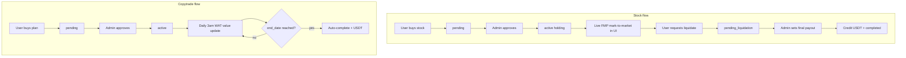

# Stock holdings + daily copytrade trading

## Locked decisions

- **Stocks = hybrid:** while held, UI shows **live FMP prices**; on liquidation, **admin sets the final payout** (profit/loss), then credit **USDT**.
- **Visibility (all three):** keep existing purchased/running items visible to their owner; pending must look “processing” not trading; never expose another user’s stocks/copytrades.

## Current baseline

- Copytrade already: buy → `pending` → admin approve → `active` → simulated P/L → complete → USDT via `[BalanceService.addFunds](ctm-backend/services/balance.service.js)`. Cron is **hourly UTC** in `[copytrade-trading.job.js](ctm-backend/jobs/copytrade-trading.job.js)`.
- Stocks: live list exists; **no purchase/hold/liquidate domain**. Portfolio Stocks tab is a placeholder.

---

## 1. Backend — Stock purchase domain (new)

**Model** `[ctm-backend/model/stock-purchase.model.js](ctm-backend/model/stock-purchase.model.js)` (new):

- `user`, `symbol`, `name`, `exchange`, `quantity`
- `purchase_price` / `initial_investment` (USD snapshot at buy request)
- `stock_status`: `pending` | `active` | `pending_liquidation` | `completed` | `cancelled`
- `live` fields not stored as source of truth — computed from FMP on read
- Liquidation: `liquidation_requested_at`, `admin_final_value`, `admin_is_profit`, `liquidated_at`, `approved_by`
- Indexes: `{ user, stock_status }`, `{ stock_status: 1 }`

**Services**

- `stock-purchase.service.js`: create (pending), approve (deduct portfolio/balance like copytrade), requestLiquidation, adminSettleLiquidation (credit USDT with admin final value; use a settlement helper that does **not** inflate `totalInvestment` — fix the known bug for this path and copytrade completion).
- Mark-to-market helper: batch-fetch prices from existing Stock model / FMP for active holdings.

**Routes** `/api/v1/stock-purchases` (mirror copytrade pattern):

| Method | Path                       | Auth  | Role                                                |
| ------ | -------------------------- | ----- | --------------------------------------------------- |
| POST   | `/`                        | user  | create purchase                                     |
| GET    | `/my-purchases`            | user  | own only                                            |
| GET    | `/:id`                     | user  | own only                                            |
| POST   | `/:id/request-liquidation` | user  | own + `active`                                      |
| GET    | `/`                        | admin | list all                                            |
| PUT    | `/:id/approve`             | admin | pending → active + deduct funds                     |
| PUT    | `/:id/settle-liquidation`  | admin | body: `{ finalValue, isProfit }` → USDT + completed |
| PUT    | `/:id/reject`              | admin | cancel pending / reject liquidation                 |

Enforce ownership on every user route (`req.user.userId === doc.user`). No cross-user list endpoints for users.

---

## 2. Backend — Copytrade daily job (retune existing)

Change `[copytrade-trading.job.js](ctm-backend/jobs/copytrade-trading.job.js)`:

- Schedule: `**0 3 * * ***` with `timezone: 'Africa/Lagos'` (3:00 AM WAT).
- Keep `completeExpiredTrades` in the same run (auto-end when `trade_end_date <= now`).
- Retarget `[calculateHourlyChange](ctm-backend/services/copytrade-trading.service.js)` → **daily** step sized to reach ROI over `trade_duration` days (same risk → target ROI mapping as today).
- Existing `active` trades keep running; no status wipe. Pending stay `pending` until admin approve (already the case).
- Settlement: credit USDT via new `BalanceService.settleTradeReturn` (portfolio + `accountBalance` only — **not** `totalInvestment`).

Optional: keep a lightweight hourly job **disabled**; single source of truth becomes the 3am WAT job.

---

## 3. User-end

**Buy stock** — wire `[stock-trading-table.tsx](ctm-user-end/components/stock-trading-table.tsx)` Buy button to `POST /stock-purchases` (Bearer token, quantity). Toast: pending until admin approval.

**Portfolio → Stocks** — replace placeholder with live table from `GET /stock-purchases/my-purchases`:

- `pending`: “Processing” badge (not trading).
- `active`: live price / current value / P/L from FMP (poll ~30–60s).
- `pending_liquidation`: “Liquidation pending”.
- `completed`: final settled value.
- Action: **Request liquidation** when `active`.

**Portfolio → Copy Trades** — already on `my-purchases`; refine UX:

- `pending` = Processing only.
- `active` = show `trade_current_value` / P/L; poll so overnight cron updates appear without refresh.
- Never call cross-user endpoints.

**Buy-sell / copytrade purchase flows** — unchanged approval gate; ensure create always starts `pending`.

---

## 4. Admin-end

New nav + pages (alongside existing copytrade purchases):

- **Stock Purchases:** tabs Pending / Active / Liquidation requests / Completed.
- Approve buy; settle liquidation with `finalValue` + `isProfit` (and show live mark-to-market as reference only).
- Copytrade purchases list: keep approve/end; confirm duration/`trade_end_date` visible so ops can see auto-end date.

---

## 5. Safety / non-regression

- Do **not** migrate or rewrite existing `CopytradePurchase` documents; only job schedule + daily formula + settlement accounting.
- User APIs always filter by `req.user.userId`.
- Admin list is admin-only.
- Deploy backend via Railway after merge; frontends stay pointed at Railway API.

---

## Implementation order

1. Backend stock model + services + routes + settlement helper
2. Copytrade cron → 3am WAT daily + settlement fix
3. User-end buy + portfolio stocks + polling
4. Admin stock purchases UI
5. Railway deploy + smoke test (pending vs active visibility, liquidation → USDT, copytrade auto-complete path)

